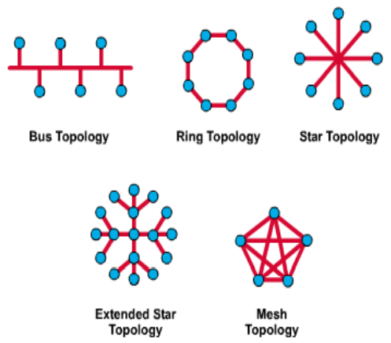
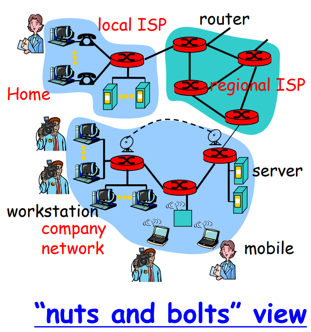
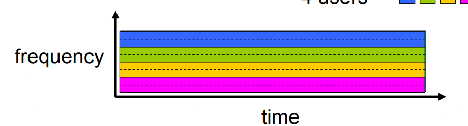
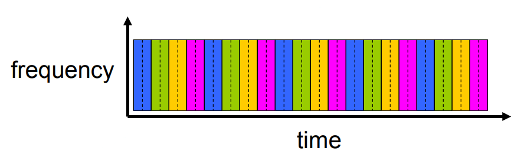
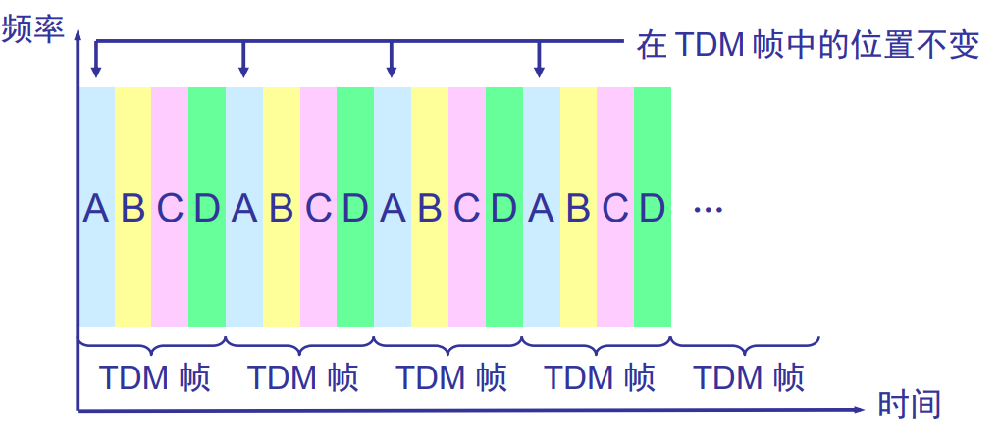
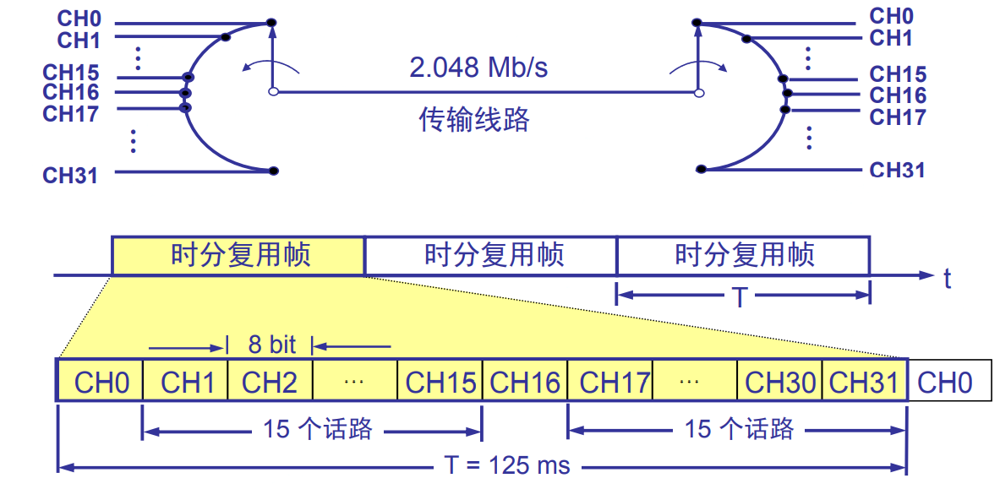
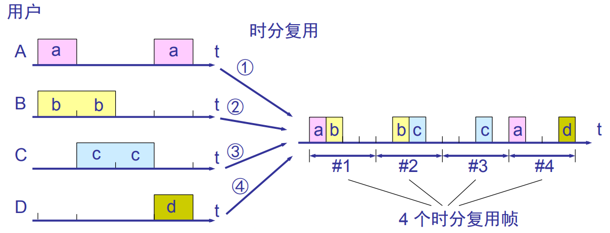
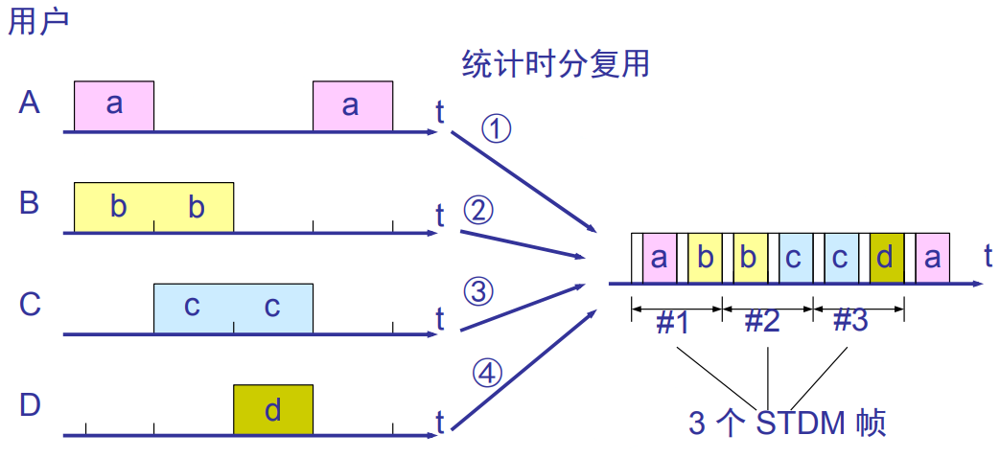
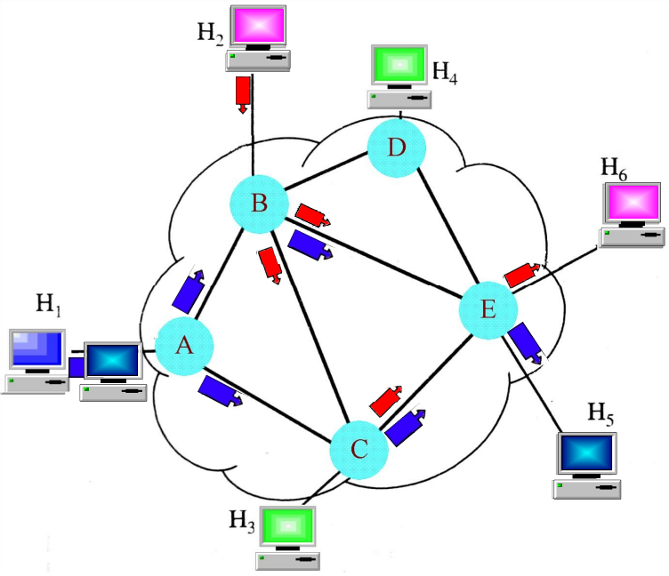
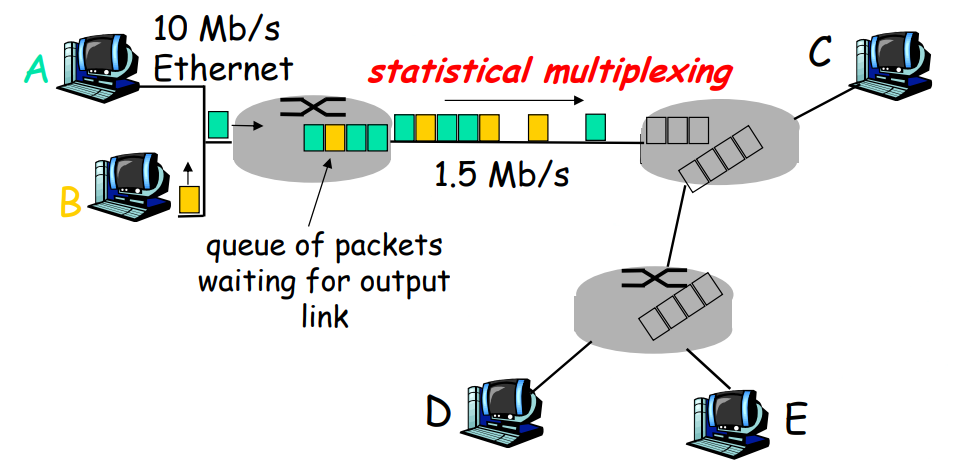

# Chapter 1: Introduction

> Aka.T: Hmm... You are not good at English? Don't worry, I will show you a table which includes some terms in Chapter 1.
>
> When you find italics in your reading, that's what I added.
>
> "Omitted" means the content of this title is not important.
>
> Some metaphors, analogies will be omitted.

| Term        | Chinese          | Term           | Chinese   |
| ----------- | ---------------- | -------------- | --------- |
| LAN         | 局域网           | Bandwidth      | 带宽      |
| WAN         | 广域网           | infrastructure | 基础设施  |
| Router      | 路由器           | Ethernet       | 以太网    |
| Switch      | 交换机           | Multiplexing   | 多路复用  |
| Protocol    | 协议             | Encapsulation  | 封装      |
| Packet      | 数据包/报文/分组 | Stack          | 栈        |
| ISP         | 因特网服务提供商 | FDM            | 频分复用  |
| TCP         | 传输控制协议     | TDM            | 时分复用  |
| UDP         | 用户数据报协议   | congestion     | 拥挤/拥塞 |
| Intranet    | 内网             | Extranet       | 外网      |
| *mainframe* | *主机*           | *topology*     | 拓扑      |

## 1.1 What is the Internet

### 1.1.1 Definition of Computer Networks

A computer network is composed of multiple computers connected together using a telecommunication system for the purpose of sharing data, resources and communication.

### 1.1.2 Features of Computer Networks

Computer network connects two or more autonomous computers.

The computers can be geographically located anywhere.

### 1.1.3 Composition of Computer Network

| Hardware                                                     | Software                                 |
| ------------------------------------------------------------ | ---------------------------------------- |
| End systems: host, PC, mainframe, client, workstation, server | Protocol: CSMA/CD, TCP/IP, UDP, PPP, ATM |
| Intermediate systems: communications: switch, router         | Applications: HTTP, SMTP, FTP, Telnet    |
| Interface: network interface card (NIC), modem               |                                          |
| Medium: twisted pair, coaxial cable, fiber, wireless         |                                          |

### 1.1.4 Application of Networks

#### 1.1.4.1 Functionality

- Resource sharing
  - Hardware: computing resources, disks, printers...
  - Software: application software...
- Information sharing
  - Easy accessibility from anywhere: files, databases...
  - Search Capability: WWW...
- Communication
  - Email
  - Message broadcast
- Remote Computing
- Distributed Processing (GRID Computing)

#### 1.1.4.2 Applications

E-mail, searchable data (Web Sites), E-commerce, news groups, Internet telephony (VoIP), video conferencing, chat groups, instant messengers, Internet radio.

#### 1.1.4.3 "Cool" Internet Appliances(Omitted)

### 1.1.5 Category of Computer Networks

#### 1.1.5.1 Classified by Topology

- The network topology defines the way in which computers, printers, and other devices are connected.

- A network topology describes the layout of the wire and devices as well as the paths used by data transmissions.

##### Bus topology

Commonly referred to as a linear bus, all the devices on a bus topology are connected by one single cable.

##### Star & Tree topology

- The star topology is the most commonly used architecture in Ethernet LANS.
- Larger networks use the extended stat topology also called tree topology.
- When used with network devices that filter frames or packets, like bridges, switches, and routers, this topology significantly reduces the traffic on the wires by sending packets only to the wires of the destination host.

##### Ring topology

- A frame travels around the ring, stopping at each node. If a node wants to transmit data, it adds the data as well as the destination address to the frame.

- The frame then continues around the ring until it finds the destination node, which takes the data out of the frame.
  - Single ring - All the devices on the network share a single cable.
  - Dual ring - The dual ring topology allows data to be sent in both directions.

#### 1.1.5.2 Classified by Boundary

##### Intranet (Private Networks)

An Intranet is a private networks that is contained within an enterprise. It may consist of many interlinked local area network and also use leased in the wide area network.

##### Extranet (Public Networks)

An extranet is a public network that uses Internet technology and the public telecommunication system to securely share part of a business's information or operations with suppliers, vendors, partners, customers, or other businesses. An extranet can be viewed as part of a company's intranet that is extended to users outside the company. It has also been described as a "state of mind" in which the Internet is perceived as a way to do business with other companies as well as to sell products to customers.

### 1.1.6 What's the Internet?

- Million of connected devices: **hosts = end systems**
- Running **network apps** 
- Communication links
  - ***Media***: fiber, copper, radio, satellite
  - **Transmission rate = bandwidth**
- **Routers**: forward packets (chunks of data)

#### "Nut and Bolts" View

- Protocol controls sending, receiving of messages
  - Examples: TCP, IP, HTTP, FTP, PPP
- Internet: "network of networks"
  - Loosely hierarchical
  - Public Internet versus private intranet 
- Internet standards
  - RFC: Request for comments
  - IETF: Internet Engineering Task Force

#### Service View

- Communication infrastructure enables distributed applications:
  - Web, email, games, e-commerce, file sharing.
- Communication services provided to apps
  - Connectionless unreliable
  - Connection oriented reliable 

### 1.1.7 What's a protocol?

#### Definition

Protocols define **format**, **order** of messages send and received among networks, actions taken on message transmission, receipt.

## 1.2 Internet History (Omitted)

## 1.3 Network Edge

### Outline

- Network edge
  - Applications and hosts
- Network core
  - Routers
  - Network of networks
- Access networks, physical media:
  - Communication links

### The Network Edge

- End system (hosts) 
  - run application programs at "edge of network". 
- Client/server model
  - client host requests, receives service from always-on server
- Peer-peer model
  - minimal (or no) use of dedicated servers

### What is Connection？

所谓连接，就是两个对等实体进行数据通信而进行的一种结合.
面向连接服务具有连接建立、数据传输和连接释放这三个阶段.

### Connected-oriented Service Versus Connectionless Service

|          | Connected-oriented Service                                   | Connectionless Service                                       |
| -------- | ------------------------------------------------------------ | ------------------------------------------------------------ |
| Goal     | Data transfer between end systems                            | Data transfer between end systems same as before             |
| Features | Handshaking: setup (prepare for) data transfer ahead of time - Hello, hello back human protocol - Set up “state” in two communicating hosts | 两个实体之间的通信不需要事先建立好一个连接 其下层的相关资源不需要预定保留，而是在数据传输时动态分配 两个实体并不一定同时是活跃的 没有流控制和拥塞控制 Best effort delivery，尽最大努力交付 不能防止报文的丢失、重复或失序，是一种不可靠的服务 |
| Protocol | TCP - Transmission Control Protocol                          | UDP - User Datagram Protocol                                 |

### TCP Versus UDP

|              | TCP [RFC 793]                                                | UDP [RFC 768]:                                               |
| ------------ | ------------------------------------------------------------ | ------------------------------------------------------------ |
| **Features** | Reliable, in-order byte stream data transfer Loss: acknowledgements and retransmissions Flow control: sender won’t overwhelm receiver Congestion control: senders “slow down sending rate” when network congested | connectionless unreliable data transfer no flow control no congestion control |
| **Apps**     | HTTP (Web) FTP (file transfer) Telnet (remote login) SMTP (email) | Streaming media Teleconferencing DNS Internet telephony QQ |

## 1.4 Network Core

- Mesh(有机组合) of interconnected routers
- The fundamental question: how is data transferred through net?
  - Circuit-switching: 电路交换
    - Dedicated circuit per call: telephone net
  - Packet-switching: 分组交换
    - Data sent thru net in discrete “chunks”

### Circuit Switching

- End-end resources reserved for “call”
  - link bandwidth, switch capacity
  - dedicated resources: no sharing
  - circuit-like (guaranteed) performance
  - call setup required

- 电路交换必须是面向连接的

- 在通话（通信）的全部时间内，通话的两个用户始终占用端到端的固定传输带宽
- 使用电路交换来传输计算机数据时，线路的传输效率往往很低.
- Network resources (e.g., bandwidth) divided into “pieces”
- Pieces allocated to calls
- Resource piece idle if not used by owning call (no sharing)
- Multiplexing: 多工，复用
- Dividing link bandwidth into “pieces”
- How to divide？
  - Frequency division (FDM)
  - Time division (TDM)
  - Code division (CDMA)

### FDM

### TDM	

#### TDM of E1

#### 时分复用可能会造成线路资源的浪费

#### STDM: 统计时分复用

#### Packet Switching

##### Statistical Multiplexing

Sequence of A & B packets does not have fixed pattern,
shared on demand  statistical multiplexing.
TDM: each host gets same slot in revolving TDM frame.

## 1.5 Network Access and Physical Media

## 1.6 Internet Structure and ISPs

## 1.7 Delay & Loss in Packet-switched Networks

## 1.8 Protocols Layers, Service Models

