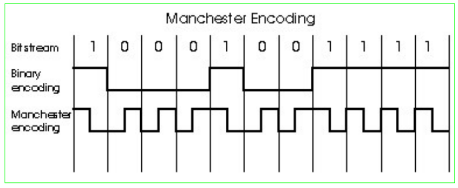

# CHAPTER 2 Link Layer and LANs

## 2.1 Introduction and services of Link Layer

## 2.2 Error detection and correction

## 2.3 Multiple access Protocols

Pure (unslotted ) ALOHA

- unslotted aloha: simpler, no-sync

- when frame first arrivess : transmit immediately

- collision probability increase: sent at $t_0 <-> [t_0-1, t_0+1]$

efficiency: (proof omitted)

## CSMA (Carrier Sense Multiple Access)

- **CSMA**: listen before transmit:
  - if channel sensed idle: transmit entire frame.
  - if busy: defer transmission.

- **CSMA collisions**
  - **collisions can still occur**: because of propagation delay -> may not hear each other.
  - **collision**: causes entire packet transmission, time wasted.
  - **note**: role of distance & propagation delay in determining collision probability.

## CSMA/CD (Collision Detection)

- CSMA/CD: carrier sensing

  - collisions detected within short time.

  - colliding transmission aborted, reducing channel wastage

- Collision detection:

  - easy in wired LANs: measure signal strengths, compare transmitted, received signals.(if signal become strong, may collision happen)
  - difficult in wireless LANs: other signal from nature or mankind may affect signal.

## "Taking Turns" MAC Protocols

- Channel partitioning MAC protocols

  - Share channel efficiently and fairly at high load.

  - Inefficient at low load: 1/N bandwidth allocated even if only 1 active node!

- Random access MAC protocols

  - Efficient at low load: single node can fully utilize channel.

  - High load: collision overhead.

- "Taking turns" protocols

#### Polling

- Master node "invites" slave nodes to transmit in turn.

- Concerns
  - Polling overhead
  - Latency
  - Single point of failure (master)

#### Token passing -> Solve polling

- Control token passed from one node to next sequentially.
- Token message
- Concerns
  - Token overhead.
  - Latency
  - Single point of failure (token loss)

## ETHERNET

#### 2 Standards of Ethernet

DIX Ethernet V2

IEEE 802.3

#### 数据链路层的两个子层

逻辑链路控制LLC(Logical Link Control)子层

媒体接入控制MAC(Media Access Control)子层

与接入到传输媒体有关的内容都放在 MAC子层，而 LLC 子层则与传输媒体无关，不管采用何种协议的局域网对 LLC 子层来说都是透明的.

##### 适配器(Adaptor)的作用

- NIC (Network Interface Card)网卡(网络接口卡)

- 功能:

  - 进行串行/并行转换
  - Cache data
  - Driver in OS
  - Implement Ethernet protocols.

#### LAN Addresses & ARP

- Each adaptor on LAN has unique LAN address.

- 12 Hex MAC Address 
  - Broadcast address: FF-FF-FF-FF-FF-FF

- 32-bit IP Address:
  - network-layer address
  - used to get datagram to dest IP subnet
- MAC(or LAN or physical or Ethernet) address:
  - Used to get frame from one interface to another physically-connected interface (same network) 
  - 48 bit MAC address (for most LANs) burned in the adapter ROM
- MAC address allocation administered by IEEE
- Manufacturer buys portion of MAC address space (to assure uniqueness)
- MAC flat address ➜ portability
- IP hierarchical address NOT portable: depends on IP subnet to which node is attached

#### ARP: Address Resolution Protocol

each IP node (host, router) on LAN has ARP table.

ARP stored `<IP addr, MAC addr, TTL>`(Time to Live, typically 20 min)

#### ARP protocol: Same LAN (network)

A -> No B in APR Table -> Broadcast req B -> B单播 -> A -> stored B's MAC

**soft state**: info may be invalid without broadcasting or informing.

**ARP is "plug-and-play"**: without intervention.

#### ARP protocol: Routing to another LAN

A -> not in same LAN -> A send to router -> -> find B in another LAN

R has 2 ARP tables.

modify src MAC and dest MAC

#### Start topology(ommitted)

#### Ethernet Frame Structure

- Preamble(前导域)

  - 10101010 前同步码

  - 10101011 帧开始定界符

- Addresses: 12 bytes
  - 6 bytes scr addr, 6 bytes dest addr
- Type
  - 2 bytes, indicates the higher protocol (normally IP) 
- CRC
  - 4 bytes

#### 无效的MAC帧

- 数据字段的长度与长度字段的值不一致；
- 帧的长度不是整数个字节；
- 用收到的帧检验序列 FCS 查出有差错；
- 数据字段的长度不在 46 ~ 1500 字节之间。
- 有效的 MAC 帧长度为 64 ~ 1518 字节之间。
- 对于检查出的无效 MAC 帧就简单地丢弃。以太网不负责重传丢弃的帧。

#### Unreliable, connectionless service

Connectionless: No handshaking between sending and receiving adapter.

Unreliable: receiving adapter doesn’t send acks or nacks to sending adapter (e.g. gaps).

#### Ethernet uses CSMA/CD

- No slots
- Adapter doesn’t transmit if it senses that some other adapter is transmitting, that is, carrier sense
- Transmitting adapter aborts when it senses that another adapter is transmitting, that is, collision detection.
- Before attempting a retransmission, adapter waits a random time, that is, random access.

- Jam Signal: make sure all other transmitters are aware of collision 48 bits

- Bit time: 1 microsec for 10 Mbps Ethernet; for K=1023, wait time is about 50 msec.

- Exponential Backoff
  - Goal: adapt retransmission attempts to estimated current load.
  - First collision: choose K from {0,1}; delay is $K \times 512$ bit transmission times.
  - After $k$ collisions: choose K from ${0, 1, 2, \cdots , 2^k -1 }$.

#### 以太网的重要特性

- 使用 CSMA/CD 协议的以太网不能进行全双工通信而只能进行双向交替通信（半双工通信）。
- 每个站在发送数据之后的一小段时间内，存在着遭遇碰撞的可能性。
- 这种**发送的不确定性**使整个以太网的平均通信量远小于以太网的最高数据率。

#### 争用期

- 最先发送数据帧的站，在发送数据帧后至多经过时间$2 \tau$（端到端往返时延）就可知道发送的数据帧是否遭受了碰撞。
- 以太网的端到端往返时延$2 \tau$称为**争用期**，或**碰撞窗口**。
- 经过争用期这段时间还没有检测到碰撞，才能肯定这次发送不会发生碰撞。

#### 二进制指数类型退避算法 (truncated binary exponential type)

发生碰撞的站在停止发送数据后，要推迟（退避）一个随机时间才能再发送数据。
确定基本退避时间，一般是取为争用期$2 \tau$

定义重传次数 k ，$k \leq 10$，即
$k = Min[重传次数, 10]$
从整数集合$[0,1,…, (2^k -1)]$中随机地取出一个数，记为 r。重传所需的时延就是 r 倍的基本退避时间。
当重传达 16 次仍不能成功时即丢弃该帧，并向高层报告。

#### 争用期的长度(Omnitted)

#### 最短有效帧长(ommitted)

#### 强化碰撞

当发送数据的站一旦发现发生了碰撞时：

- 立即停止发送数据；
- 再继续发送若干比特的人为干扰信号(jamming signal)，以便让所有用户都知道现在已经发生了碰撞。

#### 帧间最小间隔(Ommited)

#### Ethernet CSMS/CD Algorithm

#### CSMA/CD efficiency

$$ e = \dfrac{1}{1 + 5\dfrac{t_{\text{prop}}}{t_{\text{trans}}}} $$

$t_{\text{prop}}$ = max prop between 2 nodes in LAN
$t_{\text{trans}}$ = time to transmit max-size frame

### 10BaseT and 100BaseT

#### Hubs

- Hubs are essentially physical-layer repeaters:

  - Bits coming from one link go out all other links.
  - At the same rate.
  - No frame buffering.
  - No CSMA/CD at hub: adapters detect collisions.
  - Provides net management functionality.

- The working principle of hub

  - Peer to peer

  

  - B、点到多点通信

### Manchester encoding

- To Sync clock

### Gbit Ethernet(Ommitted)

## 2.6 Interconnections: Hubs and switches

- 中继器: （物理层）
- 转换器：信号转换的中继器如光电转换
- 集线器: （物理层）: 集线器是中继器的一种形式，也称为多端口中继器。
- 交换机: （链路层）:交换机是网桥的一种形式，也称为多端口网桥。

### Interconnecting with hubs

- Backbone hub **interconnects LAN segments**
- **Extends max distance** between nodes
- But individual segment collision domains become one **large collision domain**
- Can’t interconnect 10BaseT & 100BaseT

### Switch

#### Link layer device

- Stores and forwards Ethernet frames
- Examines frame header and selectively forwards frame based on MAC dest address
- When frame is to be forwarded on segment, uses CSMA/CD to access segment.

#### Transparent

- Hosts are unaware of presence of switches

#### Plug-and-play, self-learning

- Switches do not need to be configured