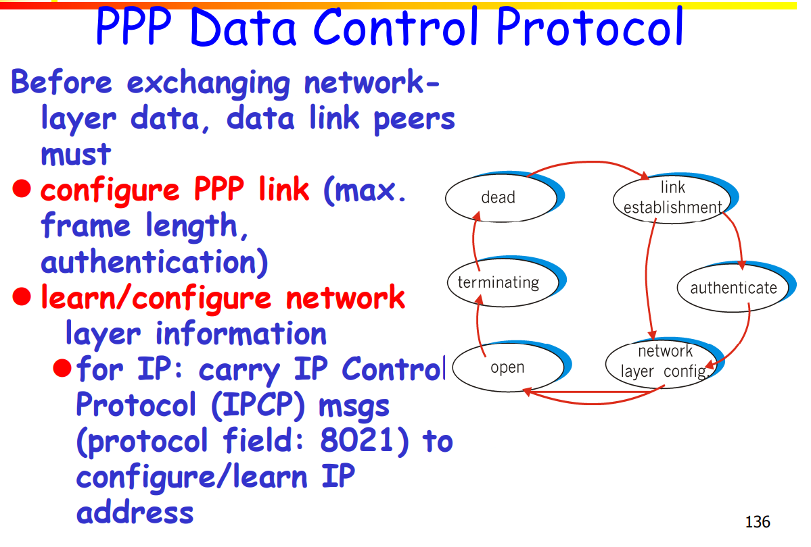

# CHAPTER 2 Link Layer and LANs

> Author: AkagawaTsurunaki@github
>
> We recommend you open this file with Typora.

## 2.1 Introduction and services of Link Layer

### 2.1.1 Some terminology


### 2.1.2 Link Layer Service

#### 2.1.2.1 Framing, link access


#### 2.1.2.2 Reliable delivery between adjacent nodes


#### 2.1.2.3 Flow Control


#### 2.1.2.4 Error Detection


#### 2.1.2.5 Half-duplex and full-duplex


### 2.1.3 Adaptors Communicating


## 2.2 Error detection and correction

### 2.2.1 Outline


### 2.2.2 Basic Methods

#### 2.2.2.1 Parity Checking


#### 2.2.2.2 Internet Checksum


#### 2.2.2.3 Ckecksumming: Cyclic Redundancy Check(CRC)


## 2.3 Multiple Access Protocols

### 2.3.1 Multiple Access Links and Protocols

#### 2.3.1.1 Two types of "links"

**Point-to-point**

- PPP for dial-up access.
- Point-to-point link between Ethernet switch and host.

**Broadcast (shared wire or medium)**

- Traditional Ethernet
- HFC
- 802.11 wireless LAN

### 2.3.2 Multiple Access Protocols

#### 2.3.2.1 Features

- Single shared broadcast channel.
- Two or more simultaneous transmissions by nodes: interference.

#### 2.3.2.2 Multiple Access Protocol

**Distributed algorithm**: Determines how nodes share channel, i.e., determine when node can transmit.
**Note**: Communication about channel sharing must use channel itself! No out-of-band channel for coordination.

### 2.3.3 Ideal Multiple Access Protocol

#### 2.3.3.1 Features

- When $M$ nodes want to transmit, each can send at average rate $\dfrac{R}{M}$, supposed broadcast channel of rate $R$ bps.
- Fully decentralized: 
  - No special node to coordinate transmissions.
  - No synchronization of clocks, slots.
- Simple.

### 2.3.4 MAC Protocols: a taxonomy

#### 2.3.4.1 Three broad classes

**Channel Partitioning**

- Divide channel into smaller “pieces” (timeslots, frequency, code) 
- allocate piece to node for exclusive use

**Random Access**

- Channel not divided, allow collisions
  - “recover” from collisions

**“Taking turns”**

- l Nodes take turns, but nodes with more to send can take longer turns

### 2.3.5 Channel Partitioning MAC Protocols: TDMA (Time Division Multiple Access)


### 2.3.6 Channel Partitioning MAC Protocols: FDMA (Frequency Division Multiple Access)


### 2.3.7 Random Access Protocols

#### 2.3.7.1 Slotted ALOHA


#### 2.3.7.2 Pure (unslotted) ALOHA

##### Features

- Simpler, no-sync.
- When frame first arrives : transmit immediately.
- Collision probability increase: sent at $t_0 <-> [t_0-1, t_0+1]$.


#### 2.3.7.3 CSMA (Carrier Sense Multiple Access)

- **CSMA: listen before transmit**:
  - if channel sensed idle: transmit entire frame.
  - if busy: defer transmission.

- **CSMA collisions**
  - **collisions can still occur**: because of propagation delay -> may not hear each other.
  - **collision**: entire packet transmission, time wasted.
  - **note**: role of **distance** & **propagation delay** in determining collision probability.

#### 2.3.7.4 CSMA/CD (Collision Detection)

- **CSMA/CD: carrier sensing**
  - collisions detected within short time.
  
  - colliding transmission aborted, reducing channel wastage
  
- **Collision detection**:
  - **Easy in wired LANs**: measure signal strengths, compare transmitted, received signals.(if signal become strong, may collision happen)
  - **Difficult in wireless LANs**: other signal from nature or mankind may affect signal.


### 2.3.8 "Taking Turns" MAC Protocols

#### 2.3.8.1 Types of protocols

- Channel partitioning MAC protocols
  - Share channel efficiently and fairly at high load.

  - Inefficient at low load: 1/N bandwidth allocated even if only 1 active node!
- Random access MAC protocols

  - Efficient at low load: single node can fully utilize channel.

  - High load: collision overhead.
- "Taking turns" protocols

#### 2.3.8.2 Polling

- Master node "invites" slave nodes to transmit in turn.

- Concerns
  - Polling overhead
  - Latency
  - Single point of failure (master)

#### 2.3.8.3 Token passing -> Solve polling

- Control token passed from one node to next sequentially.
- Token message
- Concerns
  - Token overhead.
  - Latency
  - Single point of failure (token loss)

## 2.4 ETHERNET

> Should be 2.5 according to PPT

### 2.4.1 2 Standards of Ethernet

DIX Ethernet V2

IEEE 802.3

### 2.4.2 数据链路层的两个子层

逻辑链路控制LLC(Logical Link Control)子层

媒体接入控制MAC(Media Access Control)子层

与接入到传输媒体有关的内容都放在 MAC子层，而 LLC 子层则与传输媒体无关，不管采用何种协议的局域网对 LLC 子层来说都是透明的.

### 2.4.3 适配器(Adaptor)的作用

- NIC (Network Interface Card)网卡(网络接口卡)

- 功能:

  - 进行串行/并行转换
  - Cache data
  - Driver in OS
  - Implement Ethernet protocols.


### 2.4.4 LAN Addresses & ARP

- Each adaptor on LAN has unique LAN address.

- 12 Hex MAC Address 
  - Broadcast address: FF-FF-FF-FF-FF-FF

- 32-bit IP Address:
  - network-layer address
  - used to get datagram to dest IP subnet
- MAC(or LAN or physical or Ethernet) address:
  - Used to get frame from one interface to another physically-connected interface (same network) 
  - 48 bit MAC address (for most LANs) burned in the adapter ROM
- MAC address allocation administered by IEEE
- Manufacturer buys portion of MAC address space (to assure uniqueness)
- MAC flat address ➜ portability
- IP hierarchical address NOT portable: depends on IP subnet to which node is attached

### 2.4.5 ARP: Address Resolution Protocol

Each IP node (host, router) on LAN has ARP table.

ARP stored `<IP addr, MAC addr, TTL>`(Time to Live, typically 20 min)

### 2.4.6 ARP protocol: Same LAN (network)

**Process**: A → No B in APR table → Broadcast req B → Find B → B unicasts to A → A stored B's MAC

**Soft state**: Information may be invalid without notice or broadcast.

**ARP is "plug-and-play"**: Without intervention.

### 2.4.7 ARP protocol: Routing to another LAN

**Process**: A → not in A's ARP → A send to router -> router Find B in another LAN → ...

R has 2 ARP tables, one is A, another one is B.

modify src MAC and dest MAC

### 2.4.8 Star topology(ommitted)

### 2.4.9 Ethernet Frame Structure


- Preamble(前导域)

  - 10101010 前同步码

  - 10101011 帧开始定界符

- Addresses: 12 bytes
  - 6 bytes scr addr, 6 bytes dest addr
- Type
  - 2 bytes, indicates the higher protocol (normally IP) 
- CRC
  - 4 bytes

### 2.4.10 无效的MAC帧

- 数据字段的长度与长度字段的值不一致；
- 帧的长度不是整数个字节；
- 用收到的帧检验序列 FCS 查出有差错；
- 数据字段的长度不在 46 ~ 1500 字节之间。
- 有效的 MAC 帧长度为 64 ~ 1518 字节之间。
- 对于检查出的无效 MAC 帧就简单地丢弃。以太网不负责重传丢弃的帧。

### 2.4.11 Unreliable, connectionless service

**Connectionless**: No handshaking between sending and receiving adapter.

**Unreliable**: receiving adapter doesn’t send acks or nacks to sending adapter (e.g. gaps).

#### Ethernet uses CSMA/CD

- No slots
- Adapter doesn’t transmit if it senses that some other adapter is transmitting, that is, carrier sense
- Transmitting adapter aborts when it senses that another adapter is transmitting, that is, collision detection.
- Before attempting a retransmission, adapter waits a random time, that is, random access.


- Jam Signal: make sure all other transmitters are aware of collision 48 bits


- Bit time: 1 microsec for 10 Mbps Ethernet; for K=1023, wait time is about 50 msec.

- Exponential Backoff
  - Goal: adapt retransmission attempts to estimated current load.
  - First collision: choose K from {0,1}; delay is $K \times 512$ bit transmission times.
  - After $k$ collisions: choose K from ${0, 1, 2, \cdots , 2^k -1 }$.


### 2.4.12 以太网的重要特性

- 使用 CSMA/CD 协议的以太网不能进行全双工通信而只能进行双向交替通信（半双工通信）。
- 每个站在发送数据之后的一小段时间内，存在着遭遇碰撞的可能性。
- 这种**发送的不确定性**使整个以太网的平均通信量远小于以太网的最高数据率。

### 2.4.13 争用期

- 最先发送数据帧的站，在发送数据帧后至多经过时间$2 \tau$（端到端往返时延）就可知道发送的数据帧是否遭受了碰撞。
- 以太网的端到端往返时延$2 \tau$称为**争用期**，或**碰撞窗口**。
- 经过争用期这段时间还没有检测到碰撞，才能肯定这次发送不会发生碰撞。

### 2.4.14 二进制指数类型退避算法 (truncated binary exponential type)

发生碰撞的站在停止发送数据后，要推迟（退避）一个随机时间才能再发送数据。
确定基本退避时间，一般是取为争用期$2 \tau$

定义重传次数 $k$ ，$k \leq 10$，即$k = \min{ \left \{ 重传次数, 10 \right \}  }$
从整数集合$\left \{ 0,1,…, (2^k -1) \right \}$中随机地取出一个数，记为 $r$。重传所需的时延就是$r$倍的基本退避时间。
当重传达 16 次仍不能成功时即丢弃该帧，并向高层报告。

### 2.4.15 争用期的长度

- 以太网取 51.2 μs 为争用期的长度.
- 对于 10 Mb/s 以太网，在争用期内可发送512 bit，即 64 字节.
- 以太网在发送数据时，若前 64 字节没有 发生冲突，则后续的数据就不会发生冲突。

### 2.4.16 最短有效帧长(ommitted)

- 如果发生冲突，就一定是在发送的前 64字节之内。
- 由于一**检测到冲突就立即中止发送**，这时已经发送出去的数据一定小于 64 字节。
- 以太网规定了最短有效帧长为 64 字节，凡长度小于 64 字节的帧都是由于冲突而异常中止的**无效帧**。

### 2.4.17 强化碰撞

当发送数据的站一旦发现发生了碰撞时：

- 立即停止发送数据；
- 再继续发送若干比特的人为干扰信号(jamming signal)，以便让所有用户都知道现在已经发生了碰撞。

### 2.4.18 帧间最小间隔

- 帧间最小间隔为 9.6 μs，相当于 96 bit 的发送时间。
- 一个站在检测到总线开始空闲后，还要等待 9.6 μs 才能再次发送数据。
- 这样做是为了使刚刚收到数据帧的站的接收缓存来得及清理，做好接收下一帧的准备。

### 2.4.19 Ethernet CSMS/CD Algorithm

1. Adaptor receives datagram from net layer & creates frame.
2. If adapter senses channel idle, it starts to transmit frame. If it senses channel busy, waits until channel idle and then transmits.
3. If adapter transmits entire frame without detecting another transmission, the adapter is done with frame.
4. If adapter detects another transmission while transmitting, aborts and sends jam signal.
5. After aborting, adapter enters exponential backoff: after the $m$ th collision, adapter chooses a $K$ at random from $\left \{ 0,1,2,…,2^m-1 \right \}$. Adapter waits $512K$ bit times and returns to Step 2.

### 2.4.20 CSMA/CD efficiency

$$ \text{efficiency} = \dfrac{1}{1 + 5\dfrac{t_{\text{prop}}}{t_{\text{trans}}}} $$

$t_{\text{prop}}$ = max prop between 2 nodes in LAN
$t_{\text{trans}}$ = time to transmit max-size frame

Much better than ALOHA, but still decentralized, simple, and cheap.

### 2.4.21 10BaseT and 100BaseT

#### Features

- 10/100 Mbps rate; latter called “fast ethernet”.
- T stands for Twisted Pair.
- Nodes connect to a hub: “star topology”; 100 m max distance between nodes and hub.


#### Hubs

##### Hubs are essentially physical-layer repeaters

- Bits coming from one link go out all other links.
- At the same rate.
- No frame buffering.
- No CSMA/CD at hub: adapters detect collisions.
- Provides net management functionality.

##### The working principle of hub

- Peer to peer


- 点到多点通信


### Manchester encoding


- Used in 10BaseT.
- Each bit has a transition.
- Allows clocks in sending and receiving nodes to synchronize to each other.
  - no need for a centralized, global clock among nodes.


### Gbit Ethernet

- Uses standard Ethernet frame format
- Allows for point-to-point links and shared broadcast channels
- In shared mode, CSMA/CD is used; short distances between nodes required for efficiency
- Full-Duplex at 1 Gbps for point-to-point links
- 10 Gbps now

## 2.5 Interconnections: Hubs and switches

### 2.5.1互连局域网网段的网络设备

- 中继器: （物理层）
- 转换器: 信号转换的中继器, 如光电转换
- 集线器: （物理层）: 集线器是中继器的一种形式，也称为多端口中继器。
- 交换机: （链路层）:交换机是网桥的一种形式，也称为多端口网桥。

### 2.5.2 Interconnecting with hubs

#### 2.5.2.1 Features

- Backbone hub **interconnects LAN segments**.
- **Extends max distance** between nodes.
- But individual segment collision domains become one **large collision domain**.
- Can’t interconnect 10BaseT & 100BaseT.


#### 2.5.2.2 5-4-3-2-1 Rule


### 2.5.3 Switch

#### 2.5.3.1 Link layer device

- Stores and forwards Ethernet frames.
- Examines frame header and selectively forwards frame based on MAC dest address.
- When frame is to be forwarded on segment, uses CSMA/CD to access segment.

#### 2.5.3.2 Transparent

- Hosts are unaware of presence of switches.

#### 2.5.3.3 Plug-and-play, self-learning

- Switches do not need to be configured.

----------------------------------

#### Self learning

- A switch has a switch table
- Entry in switch table:
  - (MAC Address, Interface, Time Stamp)
  - Stale entries in table dropped (TTL can be 60 min)
- Switch learns which hosts can be reached through which interfaces 
  - when frame received, switch “learns” location of sender: incoming LAN segment
  - records sender/location pair in switch table.

#### Filtering/Forwarding

```
When switch receives a frame:
	index switch table using MAC dest address
	if entry found for destination
        then {
            if dest on segment from which frame arrived
                then drop the frame
            else forward the frame on interface indicated
        }
	else flood # forward on all but the interface on which the frame arrived
```

#### Traffic isolation

- switch installation breaks subnet into LAN segments.
- switch filters packets:
  - same-LAN-segment frames not usually forwarded onto other LAN segments
  - segments become separate collision domains

#### Dedicated access

- Switch with many interfaces
- Hosts have direct connection to switch
- No collisions; full duplex

#### More on Switches

cut-through switching: forward frame immediately -> reduce latency slightly

combinations of shared/dedicated 10/100/100 Mbps interfaces

#### Switches VS Routers

- both store-and-forward devices
  - routers: network layer devices(exam network layer headers)
  - switches: link layer device

- routers maintain routing tables, implement routing algorithms.
- switches maintain switch tables, implement filtering, learning algorithms.


| Functionality     | Hubs | Routers | switches |
| ----------------- | ---- | ------- | -------- |
| Traffic isolation | NO   | YES     | YES      |
| Plug & play       | YES  | NO      | YES      |
| Optimal routing   | NO   | YES     | NO       |
| Cut through       | YES  | NO      | YES      |

#### 利用以太网交换机可以很方便地 实现虚拟局域网

- 虚拟局域网 VLAN 是由一些局域网网段构成的与物理位置无关的逻辑组。
  - 这些网段具有某些共同的需求。
  - 每一个 VLAN 的帧都有一个明确的标识符，指明发送这个帧的工作站是属于哪一个 VLAN。
- 虚拟局域网其实只是局域网给用户提供的一种服务，而并不是一种新型局域网。


- 作用: 虚拟局域网限制了接收广播信息的工作站数，使得网络不会因传播过多的广播信息(即“广播风暴”)而引起性能恶化

#### 虚拟局域网使用的以太网帧格式

- 虚拟局域网协议允许在以太网的帧格式中插入一个 4 字节的标识符，称为 VLAN 标记(tag)，用来指明发送该帧的工作站属于哪一个虚拟局域网。


- 用户优先级: 3bits 数字越大优先级越高, 
- CFI 1 bit detect whether MAC addr is classical.
- VID: VLAN标记


高速以太网
100BASE-T 以太网
l速率达到或超过 100 Mb/s 的以太网称为高速以太网。
l在双绞线上传送 100 Mb/s 基带信号的星型拓扑以太网，仍使用 IEEE 802.3的CSMA/CD 协议。100BASE-T 以太网又称为快速以太网(Fast Ethernet)。


l可在全双工方式下工作而无冲突发生, 故不使用 CSMA/CD 协议。
lMAC 帧格式仍然是 802.3 标准规定的。
l保持最短帧长不变，但将一个网段的最大电缆长度减小到 100 m。
l帧间时间间隔从原来的 $9.6 \mu s$ 改为现在的$0.96 \mu s$。


三种不同的物理层标准
l100BASE-TX
l使用 2 对 UTP 5 类线或屏蔽双绞线 STP。
l100BASE-FX
l使用 2 对光纤。
l100BASE-T4
l使用 4 对 UTP 3 类线或 5 类线。


吉比特以太网
l 允许在 1 Gb/s 下全双工和半双工两种
方式工作。
l 使用 802.3 协议规定的帧格式。
l 在半双工方式下使用 CSMA/CD 协议
（全双工方式不需要使用 CSMA/CD
协议）。
l 与 10BASE-T 和 100BASE-T 技术向
后兼容。


吉比特以太网的物理层
l 1000BASE-X 基于光纤通道的物理
层：
l 1000BASE-SX SX表示短波长
l 1000BASE-LX LX表示长波长
l 1000BASE-CX CX表示铜线
l 1000BASE-T
l 使用 4对 5 类线 UTP


10 吉比特以太网
l 10 吉比特以太网与 10 Mb/s，100 Mb/s
和 1 Gb/s 以太网的帧格式完全相同。
l 10 吉比特以太网还保留了 802.3 标准规定
的以太网最小和最大帧长，便于升级。
l 10 吉比特以太网不再使用铜线而只使用光
纤作为传输媒体。
l 10 吉比特以太网只工作在全双工方式，因
此没有争用问题，也不使用 CSMA/CD 协
议。


端到端的以太网传输
l 10 吉比特以太网的出现，以太网的工作范
围已经从局域网（校园网、企业网）扩大到
城域网和广域网，从而实现了端到端的以太
网传输。
l 这种工作方式的好处是：
l 成熟的技术
l 互操作性很好
l 在广域网中使用以太网时价格便宜。
l 统一的帧格式简化了操作和管理。


## 2.6 PPP

### 2.6.1 Point to Point Data Link Control

one sender, one receiver, one link: no media access control, no need for explicit MAC addressing.

Popular P2P DLC Protocols: PPP, HDLC


### 2.6.2 三个基本问题

#### 2.6.2.1 封装成帧


首部和尾部的一个重要作用就是进行**帧定界**


#### 2.6.2.2 透明传输

封装成帧的问题


发送端的数据链路层在数据中出现控制字符“SOH”或“EOT”的前面插入一个转义字符“ESC”(其十六进制编码是 1B)。
l 字节填充(byte stuffing)或字符填充(characterstuffing)——接收端的数据链路层在将数据送往网络层之前删除插入的转义字符。
l 如果转义字符也出现数据当中，那么应在转义字符前面插入一个转义字符。当接收端收到连续的两个转义字符时，就删除其中前面的一个。


#### 2.6.2.3 差错检测(Ommitted)

### 2.6.3 PPP 协议的组成

### 2.6.4 PPP Design Requirements

packet framing: any network layer protocol, demultiplex upwards

bit transparency: any bit pattern

err detection:

connection liveness: detect, signal link failure to network layer.

network layer address negotiation: endpoint can learn/config each other's network addr

### 2.6.5 PPP non-requirements

no err correction/recovery 

### 2.6.6 PPP data frame


### 2.6.7 PPP Data Control Protocol



### 2.6.8 PPP 协议的工作状态

l 当用户拨号接入 ISP 时，路由器的调制解调器对拨号做出确认，并建立一条物理连接。
l PC 机向路由器发送一系列的 LCP 分组（封装成多个 PPP 帧）。
l 这些分组及其响应选择一些 PPP 参数，和进行网络层配置，NCP 给新接入的 PC机分配一个临时的 IP 地址，使 PC 机成为因特网上的一个主机。
l 通信完毕时，NCP 释放网络层连接，收回原来分配出去的 IP 地址。接着，LCP 释放数据链路层连接。最后释放的是物理层的连接。


