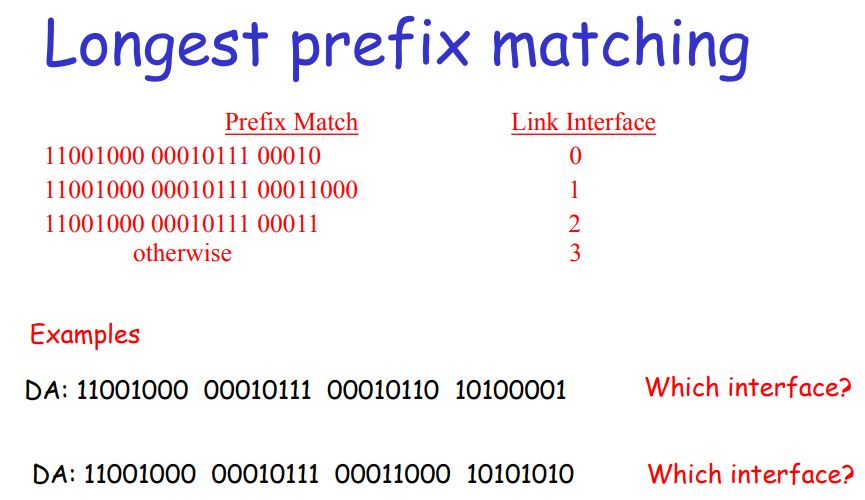

# Chapter 3 Network Layer

## 3.1 Introduction

### Network layer

Transport segment from sending to ceceiving host.

on sending side encapsulates segments into datagrams
l on rcving side, delivers segments to transport layer
l network layer protocols in every host, router
l Router examines header fields in all IP datagrams passing through it

### Key Network-Layer Functions 

forwarding: move packets from router ’ s input to appropriate router output

routing: determine route taken by packets from source to dest. 

### Interplay between routing and forwarding

## 3.2 Virtual Circuit and Datagram Networks

### Network layer connection and connection-less service

- Datagram network provides network-layer connectionless service
- VC network provides network-layer connection service
- Analogous to the transport-layer services, but:
  - Service: host-to-host
  - No choice: network provides one or the other
  - Implementation: in the core

### Virtual circuits

- “Source-to-dest path behaves much like telephone circuit”.
  - Performance-wise.
  - Network actions along source-to-dest path.
- Call setup, teardown for each call.
- Each packet carries VC identifier (not destination host address).
- Every router on source-dest path maintains “state” for each passing connection.
- Link, router resources (bandwidth, buffers) may be allocated to VC.

### VC implementation

- A VC consists of

  - Path from source to destination.

  - VC numbers, one number for each link along path.

  - Entries in forwarding tables in routers along path.

- Packet belonging to VC carries a VC number.
- VC number must be changed on each link.
  - New VC number comes from forwarding table.

### Virtual Circuits: Signaling Protocols

- Used to setup, maintain teardown VC
- Used in ATM, frame-relay, X.25
- Not used in today’s Internet

### Datagram Networks

- No call setup at network layer
- Routers: no state about end-to-end connections
  - No network-level concept of “connection”
- Packets forwarded using destination host address
  - Packets between same source-dest pair may take different paths

### Forwarding Table

### Longest Prefix Matching

### Datagram or VC network: why?

#### Internet

- data exchange among computers
  - “elastic” service, no strict timing req.

- “smart” end systems (computers)
  - can adapt, perform control, error recovery
  - simple inside network,complexity at “edge”
- Many link types
  - different characteristics
  - uniform service difficult

#### ATM (An example)

- Evolved from telephony
- human conversation:
  - strict timing,
  - reliability
  - requirements
  - need for guaranteed service
- “dumb” end systems
  - telephones
  - complexity inside network

#### 虚电路服务与数据报服务的对比

### 协议栈的层次上看数据的流动

在IP层抽象的互联网上只能看到IP数据报 图中的IP1→IP2 表示从源地址IP1 到目的地址IP2 两个路由器的IP地址并不出现在IP数据报的首部中

路由器只根据目的站的IP地址的网络号进行路由选择

在具体的物理网络的链路层 只能看见 MAC 帧而看不见 IP 数据报

IP层抽象的互联网屏蔽了下层很复杂的细节 在抽象的网络层上讨论问题，就能够使用 统一的、抽象的 IP 地址 研究主机和主机或主机和路由器之间的通信

## 3.3  What’ s inside a router

### Router Architecture Overview

#### Two key router functions:

l run routing algorithms/protocol (RIP, OSPF, BGP)
l forwarding datagrams from incoming to outgoing link

### Input Port Functions

### Three types of switching fabrics

#### Switching Via Memory

- First generation routers:
  - traditional computers with switching under direct control of CPU
  - packet copied to system’s memory
  - speed limited by memory bandwidth (2 bus crossings per datagram)

#### Switching Via a Bus

- datagram from input port memory to output port memory via a shared bus
- bus contention: switching speed limited by bus bandwidth
- 1 Gbps bus, Cisco 1900: sufficient speed for access and enterprise routers (not regional or backbone)

#### Switching Via An Interconnection Network

- Overcome bus bandwidth limitations:
- Banyan networks, other interconnection nets initially developed to connect processors in multiprocessor
- Advanced design: fragmenting datagram into fixed length cells, switch cells through the fabric.
- Cisco 12000: switches Gbps through the interconnection network

### Output Ports

- Buffering required when datagrams arrive from fabric faster than the transmission rate
- Scheduling discipline chooses among queued datagrams for transmissio

### Output port queueing

Buffering when arrival rate via switch exceeds output line speed.
Queueing (delay) and loss due to output port buffer overflow.

### Input Port Queuing

- Fabric slower than input ports combined -> queueing may occur at input queues
- Head-of-the-Line (HOL) blocking: queued datagram at front of queue prevents others in queue from moving forward
- Queueing delay and loss due to input buffer

## 3.4 IP: Internet Protocol

- The IP provides routing functions for datagrams traversing the network
- Each datagram has source and destination addresses
- IP determines if the datagram has reached its destination or if it must be forwarded
  - If it must be forwarded, IP determines the next hop
- IP does not provide a reliability guarantee
  - No assurance that a packet will reach its specified destination

- IP is also responsible for fragmentation of datagrams
- A datagram cannot exceed the maximum size for the network it is traveling on
  - This is not known at creation time
- Datagrams that are too large must be broken into fragments
- Each fragment must contain the information required to reassemble the original datagram
  - Labeled with a length and an offset

#### The Internet Network layer

Host, router network layer functions:

### The Workhorse

### 3.4.1 IPv4 Datagram format

lIPv4: 32-bit* number.
l Written in Dotted Decimal
Notation:205.150.58.7
l4 billion different host addresses
lIPv6: 128-bit* number.
l Written in Hex Decimal Notation
2001:0503:0C27:0000:0000:0000:0000:0000
l16 billion billion network addresses

### 3.4.2 IPv4 Addressing

### 3.4.3 ICMP

### 3.4.4 IPv6

